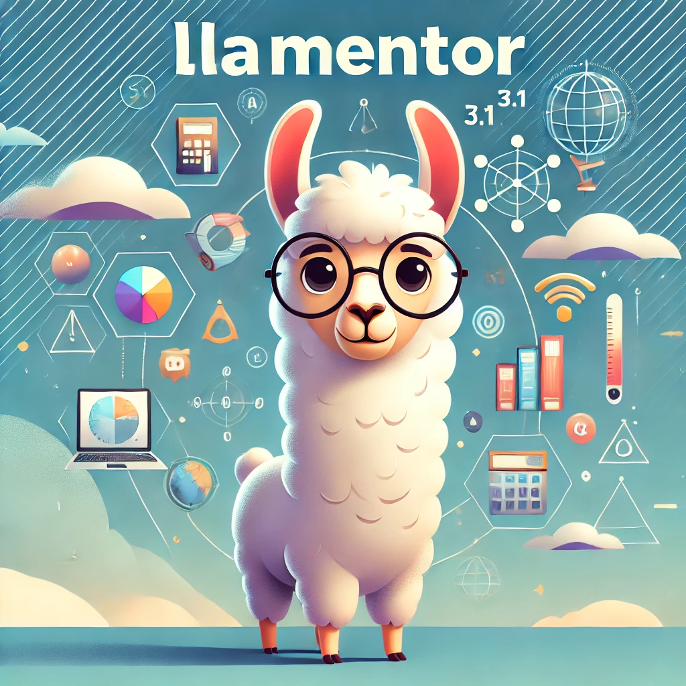
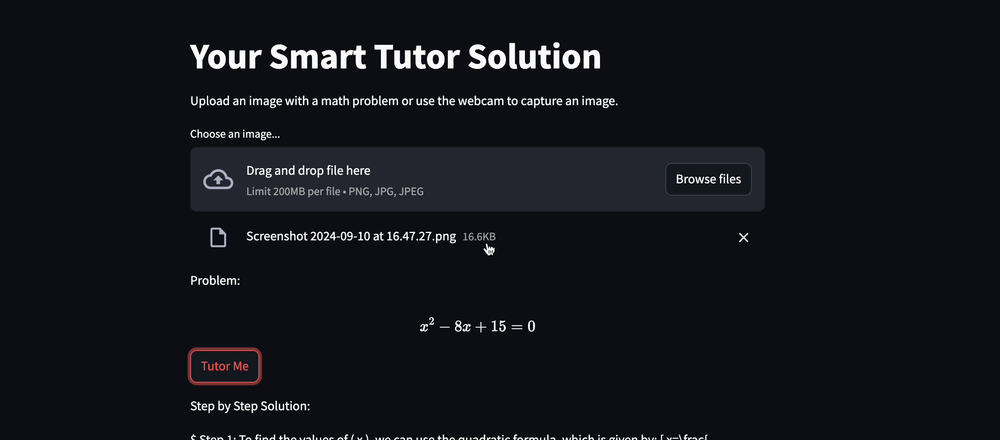

# LLaMentor


## Overview

This repository contains a Streamlit application that helps students solve math problems using image recognition and language models. The application uses a combination of Pix2Text for recognizing text in images, a Llama 3.1 8B model for generating step-by-step solutions, and a VITS model for converting text solutions into speech. The text-to-voice feature is designed to assist students who may struggle to understand written explanations, as well as those who are visually impaired, providing them with an inclusive learning experience.


## Features

- Upload or capture images containing math problems.
- Recognize text and formulas from images.
- Generate step-by-step solutions in LaTeX format.
- Convert solutions to speech.
- Dockerized for easy deployment and environment consistency.

## Getting Started

To get started with this project, you need to have Docker installed on your machine.

### Prerequisites

- [Docker](https://www.docker.com/get-started) installed.

### Building and Running the Docker Container

1. Clone this repository:

    ```bash
    git clone https://github.com/your-username/your-repository.git
    cd your-repository
    ```

2. Build the Docker image:

    ```bash
    docker build -t streamlit-app .
    ```

3. Run the Docker container:

    ```bash
    docker run -p 8501:8501 streamlit-app
    ```

   Alternatively, if using Docker Compose:

    ```bash
    docker-compose up --build
    ```

4. Access the application by navigating to `http://localhost:8501` in your web browser.


# Multimodal AI Smart Tutor Agent for Enhance Student's Understanding 
NOTE: will be updated afterlaunchpad testing...
## Features

- **Multi-format Document Processing**: Handles text files, PDFs, PowerPoint presentations, and images.
- **Advanced Text Extraction**: Extracts text from PDFs and PowerPoint slides, including tables and embedded images.
- **Image Analysis**: Uses a VLM (NeVA) to describe images and Google's DePlot for processing graphs/charts on NIM microservices.
- **Vector Store Indexing**: Creates a searchable index of processed documents using Milvus vector store.
- **Interactive Chat Interface**: Allows users to query the processed information through a chat-like interface.

## Setup

1. Clone the repository:
```
cd multimodal-rag-tutor
```

2. Set up your NVIDIA API key as an environment variable:
```
export NVIDIA_API_KEY="your-api-key-here"
```

3. Refer this [tutorial](https://milvus.io/docs/install_standalone-docker-compose-gpu.md) to install and start the GPU-accelerated Milvus container:

```
docker compose up
```


## Usage

1. Ensure the Milvus container is running:

```bash
docker ps
```

2. Run the Streamlit app:
```
streamlit run app.py
```

3. Open the provided URL in your web browser.

4. Choose between uploading files or specifying a directory path containing your documents.

5. Process the files by clicking the "Process Files" or "Process Directory" button.

6. Once processing is complete, use the chat interface to query your documents.