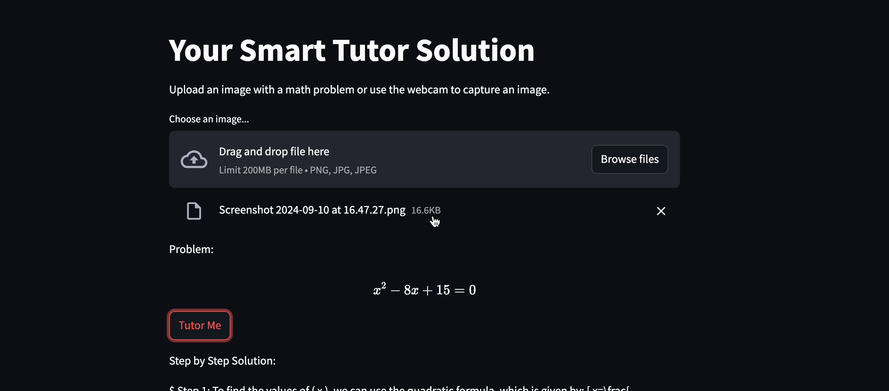

# Streamlit Math Tutor Application

## Overview

This repository contains a Streamlit application that helps students solve math problems using image recognition and language models. The application uses a combination of Pix2Text for recognizing text in images, a Llama 3.1 8B model for generating step-by-step solutions, and a VITS model for converting text solutions into speech.


## Features

- Upload or capture images containing math problems.
- Recognize text and formulas from images.
- Generate step-by-step solutions in LaTeX format.
- Convert solutions to speech.
- Dockerized for easy deployment and environment consistency.

## Getting Started

To get started with this project, you need to have Docker installed on your machine.

### Prerequisites

- [Docker](https://www.docker.com/get-started) installed.

### Building and Running the Docker Container

1. Clone this repository:

    ```bash
    git clone https://github.com/your-username/your-repository.git
    cd your-repository
    ```

2. Build the Docker image:

    ```bash
    docker build -t streamlit-app .
    ```

3. Run the Docker container:

    ```bash
    docker run -p 8501:8501 streamlit-app
    ```

   Alternatively, if using Docker Compose:

    ```bash
    docker-compose up --build
    ```

4. Access the application by navigating to `http://localhost:8501` in your web browser.